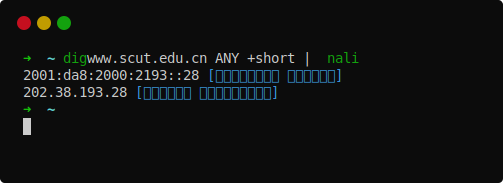

<p align="center">
  
</p>

<h1 align="center">Nali Go</h1>

<p align="center">给IP加上地理信息的命令行小工具</p>

<p align="center">
<a title="Release" target="_blank" href="https://github.com/Mikubill/nali-go/releases"></a>
<a title="Go Report Card" target="_blank" href="https://goreportcard.com/report/github.com/Mikubill/nali-go"></a>
</p>

本项目支持IPv4（纯真IP数据库）和IPv6（ZX公网IPv6库）。

## 下载/运行 说明

Go语言程序, 可直接在[发布页](https://github.com/Mikubill/nali-go/releases)下载使用。

Query simple IP address:

```bash
➜ nali-go 2.3.6.7 1.1.2.5

2.3.6.7 [法国 Orange]
1.1.2.5 [福建省 电信]

➜ nali-go 2001:da8:2:1::2

2001:da8:2:1::2 [中国北京市 教育网(CERNET2N)骨干网-清华大学-郑州大学]
```

Query IP addresses from `stdin`:

```bash
➜  dig github.io +short | nali-go

185.199.110.153 [美国 GitHub+Fastly节点]
185.199.111.153 [美国 GitHub+Fastly节点]
185.199.109.153 [美国 GitHub+Fastly节点]
185.199.108.153 [美国 GitHub+Fastly节点]
```

Use Nali CLI built-in tools shortcut:

```bash
➜ nali-go nslookup ip.sb

Server:         1.0.0.1 [美国 APNIC&CloudFlare 公共 DNS 服务器]
Address:        1.0.0.1 [美国 APNIC&CloudFlare 公共 DNS 服务器]#53

Non-authoritative answer:
Name:   ip.sb
Address: 119.9.95.61 [香港 Rackspace Hosting公司]
```

Update IP Database:

```bash
➜ nali-go update
```

Delete IP Database:

```bash
➜ nali-go delete
```

Check Version:

```bash
➜ nali-go version

NaLi-Go 
Source: https://github.com/Mikubill/nali-go
Git Commit Hash: 61e7869a02dc88c28093fac5a5aa35c06ef18333
```

## 编译 说明

安装 Go
```bash
wget https://dl.google.com/go/go1.13.6.linux-amd64.tar.gz
tar -C /usr/local -xzf go1.13.6.linux-amd64.tar.gz
export PATH=$PATH:/usr/local/go/bin:`pwd`/go/bin/
```

然后设置一下GOPROXY：

```bash
export GOPROXY=https://goproxy.cn
```

clone本项目，然后编译即可。

```bash
go get -u github.com/Mikubill/nali-go
go install github.com/Mikubill/nali-go
```

## Related

- [Sukka - NaLi-CLI](https://github.com/sukkaw/nali-cli)
- [CZ88 QQIP 数据库](http://www.cz88.net/fox/ipdat.shtml) 纯真网络提供的免费离线 IP 数据库
- [QQWry Mirror](https://qqwry.mirror.noc.one) Just a mirror of qqwry ipdb

